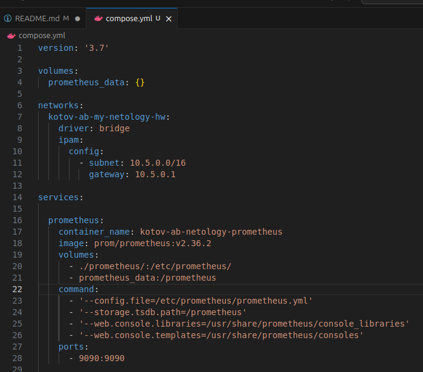
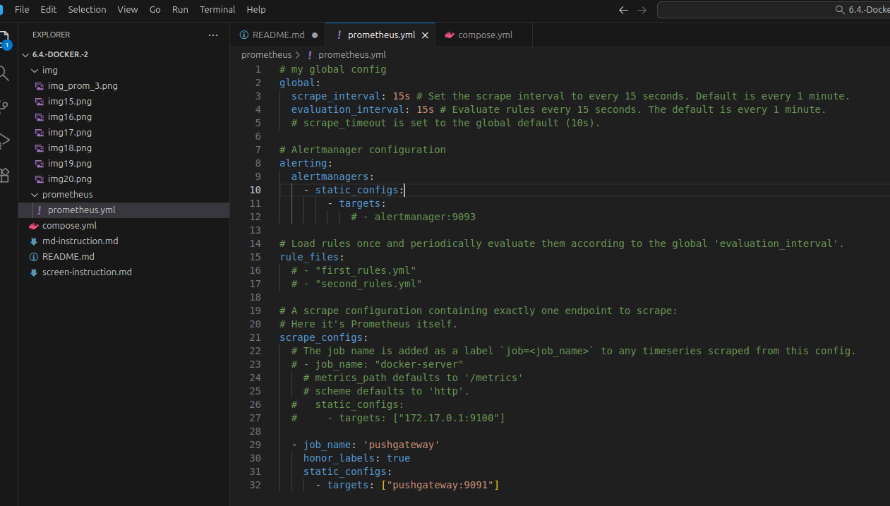
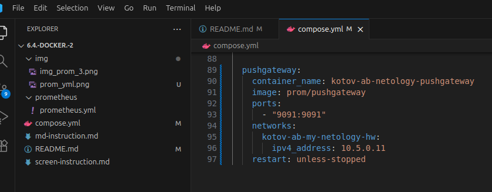

# Домашнее задание к занятию "`6.4. Docker. Часть 2`" - `Котов Александр`

### Задание 1

`Установите Docker Compose и опишите, для чего он нужен и как может улучшить лично вашу жизнь`

Docker compose используется для описания того как должен развернуться контейнер. В нем указываются конкретные команды, которые необходимо выполнить. Таким образом, чтобы развернуть на 10 устройствах контейнеры с одним сервисом - нам нужно будет всего лишь 10 раз запустить один docker compose. Если бы его не было - пришлось бы на каждом из 10 устройств писать каждую команду вручную, что было бы намного дольше и увеличился бы шанс сделать ошибку.


---

### Задание 2

Создайте файл docker-compose.yml и внесите туда первичные настройки:

* version;
* services;
* volumes;
* networks.

При выполнении задания используйте подсеть 10.5.0.0/16. Ваша подсеть должна называться: <ваши фамилия и инициалы>-my-netology-hw. Все приложения из последующих заданий должны находиться в этой конфигурации

#### Текс конфига на данном этапе выглядит так:

```
version: '3.7'

volumes: {}

networks:
  kotov-ab-my-netology-hw:
    driver: bridge
    ipam:
      config:
        - subnet: 10.5.0.0/16
          gateway: 10.5.0.1

services: {}

```

---

### Задание 3


1. `Создайте конфигурацию docker-compose для Prometheus с именем контейнера <ваши фамилия и инициалы>-netology-prometheus`
2. `Добавьте необходимые тома с данными и конфигурацией (конфигурация лежит в репозитории в директории 6-04/prometheus )`
3. `Обеспечьте внешний доступ к порту 9090 c докер-сервера.`

`Настройки Docker compose для прометея`


`Конфигурационный файл для самого прометея`



### Задание 4


1. `Создайте конфигурацию docker-compose для Pushgateway с именем контейнера <ваши фамилия и инициалы>-netology-pushgateway`
2. `Обеспечьте внешний доступ к порту 9091 c докер-сервера`



